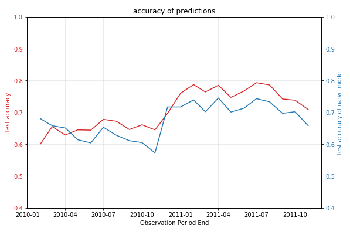
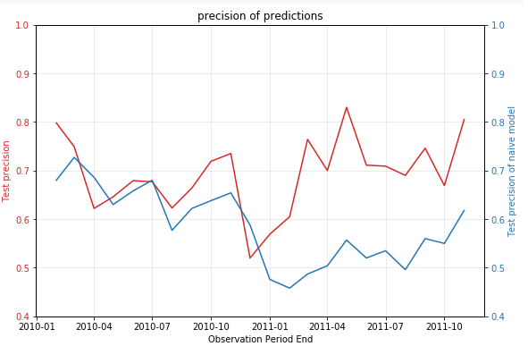

# Predict purchases next month

Using the same online retail dataset as [this project](https://github.com/W-Tran/online-retail), I instead build an ML classifier to predict whether a customer will purchase within the next month based on their daily aggregate monetary (amount) and temporal (frequency) purchase statistics. The data is split into monthly calibration/holdout sets where the previous month's transactions are used as training labels (features are built on all transactions leading up to the previous month) whilst the model is tested on next month's purchases which are unseen data.  

The ML model is compared to a naive model baseline which predicts that all customers with a purchase frequency of less than a month will purchase again within the next month. A small lift in accuracy over the naive model is observed throughout the first and second year, however there is considerable lift over the naive model in precision after 1 year of data is used to train the model. 

The rationale behind evaluating using precision is that we care most about True Positives, a customer purchasing when we think they will, as it represents anticipation of voluntary customer engagement. We can perhaps use this information in order to act to prevent churn for high risk customers who are still "alive" or attempt to promote a low/medium value customer to a high value customer using marketing tactics or by other means.

**Notes/Future work**

- Categorical features can be added to the feature set by taking into consideration what exactly a customer is buying and how that may relate to whether a customer will purchase within the next month. I am currently in the process of exploring NLP preprocessing methods to clean item descriptions/Stock codes as well as using categorical embeddings to encode items into features that may boost the performance of the ML models.
- Probabilistic [BTYD](https://en.wikipedia.org/wiki/Buy_Till_you_Die) [models](https://lifetimes.readthedocs.io/en/latest/) were explored extensively for use in this project. However most available packages were not able to deal with the heavy seasonality in the purchase behaviour of customers for this particular online retail (a gift shop which sees a huge surge in sales leading up to Christmas). Fitting BTYD model parameters without incorporating seasonality results in poor performance.
- [Discrete Survival models](https://data.princeton.edu/wws509/notes/c7s6) were also explored for this project (inspired by [this talk](https://www.youtube.com/watch?v=uU1u6JQCg5U)) but also failed to perform well in predicting purchase behaviour. I also intend to study survival models a bit more in the future to explore ways in which they can be used for online retail settings.

  
  

